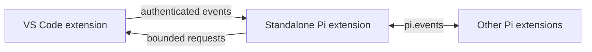

# Pi Coding Agent for VS Code

Use Pi in VS Code through a dedicated conversation view, the native `@pi` chat participant, and focused editor actions.

## Features

- Stream, resume, rename, export, or delete persistent Pi sessions in Ask, Edit, Plan, or Agent mode.
- Attach selections, files, diagnostics, terminal text, and images as bounded context, including image paste with Ctrl/Cmd+V.
- Send editor context-menu actions into the persistent Pi Chat session so follow-up questions retain the conversation.
- Choose generated edit hunks, preview the selected result, then apply once; inspect staged Git findings and bounded request checkpoints.
- Inspect, redact, or pin attachment snapshots; repair failing tests with approved reruns; ask read-only questions about selected paused Node.js debug values.
- Fix error and warning diagnostics from the lightbulb menu, editor toolbar, or Ctrl/Cmd+I, with a diff preview before applying.
- Run inline completions, predicted next edits, and parallel background or worktree agents.
- Use Pi models, thinking levels, commands, prompt templates, skills, and extensions.
- Connect standalone Pi extensions and VS Code extensions through a local authenticated request/event bridge.
- Let Pi read the active VS Code editor context, open source locations, and show requested notifications.

## Requirements

- VS Code 1.106 or newer.
- [Pi](https://pi.dev) installed and authenticated.

Confirm that Pi is available in the VS Code environment:

```bash
pi --version
```

## Install

If you previously installed `narumitw.pi-coding-agent`, uninstall that legacy extension first (in the connected remote environment too, when applicable):

```bash
code --uninstall-extension narumitw.pi-coding-agent
```

The current extension ID is `narumi.pi-coding-agent`. VS Code treats these IDs as separate extensions, not an upgrade; do not enable both at once.

Install the standalone Pi extension and the VSIX from this repository:

```bash
just install
```

The Pi extension is copied to `${PI_CODING_AGENT_DIR:-~/.pi/agent}/extensions/pi-vscode.ts`.
Run **Developer: Reload Window** after installation or an update.
Open a new integrated terminal so Pi inherits the authenticated bridge environment.

To install only the standalone Pi extension:

```bash
just install-pi-extension
```

## Use

1. Open **Pi: Open Chat** from the Command Palette or select **Pi** in the Secondary Sidebar.
2. Choose Ask, Edit, Plan, or Agent mode.
3. Use **Add context** or paste a supported image into the composer with Ctrl/Cmd+V.
4. Enter a request and review any proposed changes before applying them.
5. Place the cursor on a red or yellow diagnostic and press Ctrl/Cmd+I, choose **Fix with Pi** from the lightbulb menu, or select the Pi quick-fix toolbar button; then preview and apply the proposal in Pi Chat. With no diagnostic at the cursor, Ctrl/Cmd+I falls back to the focused inline-edit prompt.
6. Select code and use the editor's **Pi** context menu; its request and result appear in Pi Chat for continued follow-up.
7. Use `@pi` in the native Chat view when VS Code's native participant workflow is preferred; its history remains separate from the Pi Sidebar session.
8. Ask Pi to inspect the active editor or open a file when the VS Code bridge tools are useful.

The header shows the current thinking level and lets you change it directly. Use **More…** for session resume, commands, compaction, export, terminal handoff, and background or worktree agents.
The standalone Pi extension exposes `vscode_context`, `vscode_open_file`, and `vscode_notify` when Pi runs in a new VS Code integrated terminal or a session started by the Pi view.
Automatic inline completions are disabled by default and can be enabled with `piCodingAgent.inlineCompletions.enabled`.

## Workflow Tools

| Workflow | Entry point and steps |
| --- | --- |
| Staged review | **More… → Review Staged Changes** or **Pi: Review Staged Changes**. Inspect the bounded provider-bound snapshot and confirm. **Pi: Show Staged Findings** navigates immutable before/after content, never unstaged editor positions. Changed HEAD/index makes findings stale. |
| Selected edits | On a proposal card, **Choose Hunks → Preview → Apply**. Changing selection invalidates Preview. Apply uses one workspace edit and finishes the proposal; unselected hunks remain unapplied. Use normal editor Undo. |
| Task result import | Start an isolated worktree agent through **More…**. Once inactive, use its card's **Review Results → Apply Selected**. Import selected regular text files into the originating worktree; keep the task worktree until explicit removal. Non-isolated tasks use Source Control. |
| Context inspector | **Inspect Context** next to attachments, or **Add context → Inspect Context**. Inspect exact text snapshots, edit/redact, remove, pin/unpin, or explicitly refresh from source. Only consumed unpinned revisions disappear after an accepted send. |
| Failed-test repair | **More… → Repair Failed Test** or **Pi: Repair Failed Test (Preview)**. Enter an executable/argument JSON object, select one saved source file, approve a test run or select an existing multiline UTF-8 log file, inspect/redact, then Preview/Apply. Saving and rerunning the original command require approval; at most two repair attempts. |
| Checkpoint history | **More… → Request Checkpoints**. Inspect coverage, choose files, preview, then **Revert Covered Changes**. Memory-only request history is not a Git or transcript rewind. Existing file-card Diff/Open/Revert remains available for covered changes. |
| In-flight text | During an ordinary composer request, use **Steer** (after current tool calls) or **Follow Up**. **Inspect Queue** opens the pending-text snapshot; **Clear Queue** recovers cleared text. **Recovered Drafts** appends a selected draft only if the composer revision is unchanged. No attachments or slash commands are queued. |
| Debug question | Pause a Node.js debugger, select a frame, then **More… → Ask Debug Context** or **Pi: Ask Debug Context**. Approve local capture, choose variables, inspect/redact, and enter a question. Resuming/changing frames invalidates the snapshot. |

All new process and mutation workflows require a trusted, file-backed workspace. Foreground targets must match Pi's active working directory/session. Repository subfolder workspaces support staged review and task import: approval identifies the repository-wide scope/destination, while Pi remains bound to the selected workspace. Open a task worktree in its own window to resume its isolated session; cross-worktree session resume is rejected.

### Workflow limits

- Staged review excludes binary, symlink, submodule, oversized, and omitted files. Limits: 100 reviewed files, 100 KB per blob, 400 KB total blobs, 200 KB diff, 45-second capture. Unstaged/branch/PR review is not included.
- Hunk generation uses bounded line comparison; oversized comparisons fall back to one whole-target hunk. No incremental remainder application or automatic rebase.
- Task import covers additions, modifications and deletions, including task commits and untracked files. Limits: 100 reviewed files, 100 KB per file side, 400 KB total text. Executable-bit changes/additions, symlinks, binary and unsupported paths are not imported; non-UTF-8 path records reject capture. Legacy tasks without verified base/origin metadata cannot import. Dirty or overlapping destination edits block import; partial I/O failures report applied/skipped/failed paths without deleting recovery source. Tests are **not verified** by a model summary.
- Attachments: 8 items, 200,000 characters per text item, 400,000 total text characters, up to 5 images of 5 MiB each. Pins share these limits, never refresh silently, and expire on session change/reload. Estimates use UTF-8 bytes / 4 for text; image token usage and Pi context-window usage may be unknown. Inspection does not include Pi history, instructions, or later tool reads. Temporary attachment editing uses a normal untitled editor; close/discard it when finished.
- Test runner: explicit executable and argument array, no shell expression. Example: `{"executable":"node","args":["--test","test/example.test.js"]}`. Use a direct runner executable on Windows rather than a `.cmd` shell shim. Runs have a 60-second timeout and 256 KiB output cap; supplied UTF-8 log files are limited to 100,000 bytes, transmitted logs to 100,000 characters, and selected source to 200,000 characters. The source must be clean and match disk; version/content changes around a run or before a proposal require fresh evidence. Supplied logs preserve line endings and are not labelled as observed runs. No private Test Explorer integration or autonomous command generation. Cancellation attempts owned process-group cleanup on POSIX; Windows/escaped descendants cannot be guaranteed stopped and are reported.
- Checkpoints: before-prompt capture of up to 10,000 entries / 20 MiB existing regular text; retain 20 requests, 2 MiB per file side and 20 MiB total before/after text. Capture may briefly delay submission on large/remote trees. Only deterministic announced edit/write outcomes matching captured final disk text are restorable. Dirty, symlink, hardlink, uncaptured, created/deleted and ambiguous files are excluded. Shell/custom-tool requests and process exits without settlement are non-restorable. Newer dependent checkpoints must be reverted first. Restore/import are not filesystem-wide transactions; external writers can race checks.
- Queue: 10 messages / 50,000 characters, ordinary composer only, same mode/session through `agent_settled`. Cancellation clears before abort. Pi versions without validated queue commands/state disconnect on unsupported or uncertain acceptance; recovered text is never replayed automatically. Check history before resending an uncertain draft.
- Debug: `node`/`pwa-node` js-debug paths only; 20 frames, 50 local variable candidates, 1,000 characters/value, 20,000 total characters, five-second DAP deadline. No evaluate, memory, mutation, lazy-value or recursive requests. Custom description/property generators and automatic getters must be disabled in the debug session's workspace; the guard is rechecked before DAP reads. Adapter inspection may have side effects. Capture begun before activation requires a fresh observed pause. No debug pins or raw debug persistence by this extension; approved transmission becomes normal Pi conversation data.

See [Security](https://github.com/narumiruna/pi-vscode/blob/main/docs/SECURITY.md) and [Workflow validation](https://github.com/narumiruna/pi-vscode/blob/main/docs/WORKFLOW_VALIDATION.md). Interactive minimum/current VS Code and remote UI checks are deferred to real-world use; they are not claimed as passed.

## Extension Bridge



Other Pi extensions can send an allowlisted VS Code request and receive its correlated response:

```typescript
pi.events.emit("vscode:request", {
  id: "current-editor",
  method: "context",
  params: {},
});

pi.events.on("vscode:response", response => {
  // response is { id, ok, result } or { id, ok, error }.
});

pi.events.on("vscode:event", message => {
  // message is { event, data } from a VS Code extension.
});
```

VS Code extensions in the same Extension Host can activate `narumi.pi-coding-agent` and call its exported `broadcast(event, data)` API.
Event names and payloads are validated and bounded before delivery.

## Key Settings

| Setting | Default | Purpose |
| --- | --- | --- |
| `piCodingAgent.executablePath` | `pi` | Sets the Pi executable or absolute path. |
| `piCodingAgent.defaultMode` | `ask` | Selects the mode for new conversations. |
| `piCodingAgent.agent.confirmToolCalls` | `dangerous` | Controls approval for mutating tools. |
| `piCodingAgent.approveProjectResources` | `false` | Allows trusted project-local Pi resources. |
| `piCodingAgent.sensitiveContextNames` | Sensitive filename fragments | Best-effort attachment warnings; inspect/redact before sending. |
| `piCodingAgent.inlineCompletions.enabled` | `false` | Enables automatic inline completions. |

## Security

Ask and Plan are read-only, Edit can modify files without shell access, and Agent enables the complete coding toolset after confirmation.
Generated edits use a diff preview and require explicit application.
Project-local Pi resources remain disabled until the workspace is trusted and the setting is enabled.
Prompts and context are sent to the Pi subprocess through standard input rather than command-line arguments.

## Development

```bash
npm install
npm test
npm run package
```

Use `just dev` to compile the VS Code extension, launch an Extension Development Host, and run `pi -ne -e resources/pi-vscode-bridge.ts` in the invoking terminal.
Both `just dev` and the **Run Extension** debug configuration disable `narumitw.pi-coding-agent` for the development window to avoid competing with the current extension. This does not uninstall it or disable it in other windows.

## Troubleshooting

### View provider for `piCodingAgent.chatView` already registered

Check for the legacy `narumitw.pi-coding-agent` alongside the current `narumi.pi-coding-agent`. They contribute the same view and commands, so only one may be enabled in a window.

- In Extensions, search for `@id:narumitw.pi-coding-agent`, disable the legacy extension, and run **Developer: Reload Window**. For WSL/SSH/containers, check the extension in the connected remote environment as well.
- When upgrading, uninstall the legacy ID using the command in **Install**, install the current VSIX, and reload the window.
- When developing, close the existing Extension Development Host and relaunch through `just dev` or **Run Extension** so the updated launch arguments take effect; reloading an already-running development window does not add those arguments.

## License

MIT
