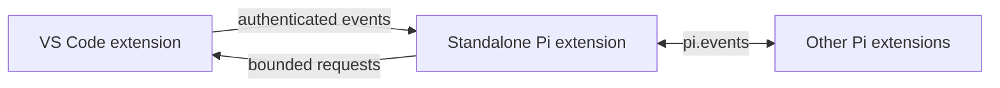

# Pi for VS Code

Use your existing [Pi](https://pi.dev) setup directly in VS Code. Pi adds a persistent sidebar, the native `@pi` chat participant, editor-aware context, and review-first editing workflows.

## Highlights

- **Persistent sessions** — Browse, search, and switch recent workspace sessions, then rename, compact, export, delete, or hand them off to a terminal.
- **Editor-aware context** — Attach selections, files, diagnostics, language-provider definitions/references/call hierarchy/symbols, terminal text, and images. Inspect, redact, refresh, or pin a snapshot before sending it.
- **Review-first edits** — Preview a complete proposal or selected hunks, then apply the reviewed result with one workspace edit.
- **Focused workflows** — Review Git changes in four scopes, repair workspace diagnostics across files, import isolated worktree results, repair failed tests, restore request checkpoints, and inspect paused Node.js debug values.
- **Pi ecosystem support** — Keep using your Pi providers, models, thinking levels, prompt templates, skills, extensions, and contributed tools.
- **VS Code integration** — Fix diagnostics, rewrite selections, generate tests, request inline completions, and predict the next edit.

See the [feature matrix](docs/FEATURE_MATRIX.md) for the complete capability map.

## Requirements

- VS Code 1.106 or newer
- [Pi](https://pi.dev), installed and authenticated

Confirm that Pi is available in the environment where VS Code runs the extension:

```bash
pi --version
```

## Install

Ensure the VS Code `code` command is available, then install the latest release:

```bash
curl -fsSL https://raw.githubusercontent.com/narumiruna/pi-vscode/main/scripts/install.sh -o install-pi-vscode.sh &&
sh install-pi-vscode.sh &&
rm install-pi-vscode.sh
```

Review [`scripts/install.sh`](scripts/install.sh) before running it if your environment does not allow downloaded scripts to execute directly. The command stops if the download fails. The installer downloads the latest `pi-coding-agent-vscode.vsix`, installs it with `code --install-extension`, and removes the exact legacy global bridge filenames created by older releases. Extension activation performs the same exact cleanup for standard VSIX or Marketplace upgrades before starting Pi, so an old global copy cannot load beside the bundled bridge. New installations do not create files under `~/.pi/agent`.

To install a specific version, pass it to the downloaded script, for example `sh install-pi-vscode.sh 0.0.2`.

After installation or an update, run **Developer: Reload Window**. Sidebar sessions and **More… → Open in Terminal** load the bridge bundled with the active VSIX. A new ordinary integrated terminal inherits the authenticated bridge environment and bridge path, but plain `pi` does not load it automatically; use `pi --extension "$PICODE_BRIDGE_EXTENSION"` in POSIX shells or `pi --extension $env:PICODE_BRIDGE_EXTENSION` in PowerShell when you explicitly want bridge tools there.

## Install from source

Building from source additionally requires Node.js, npm, and [`just`](https://just.systems):

```bash
npm install
just install
```

`just install` packages and installs the VS Code extension, then removes the exact legacy global bridge filenames created by older releases. It does not install a Pi extension under `${PI_CODING_AGENT_DIR:-~/.pi/agent}`. The extension ID is `narumi.pi-coding-agent-vscode`.

Run **Developer: Reload Window** after installation. Use Sidebar **Open in Terminal** for an automatically bridged terminal Pi session, or use the explicit `PICODE_BRIDGE_EXTENSION` command shown above in a new ordinary integrated terminal.

## Get started

1. Run **Pi: Open Sessions** from the Command Palette, or open **Pi** in the Secondary Sidebar. Choose a session from **Sessions**, or use **View all** to search the current workspace. Sending from the Sessions-level composer starts a new session; **Back to Sessions** returns there from a conversation.
2. Choose **Attach** to add code, files, or images, or paste a supported image with Ctrl/Cmd+V.
3. Enter a request. The active model and thinking level appear beside **Send**.
4. For proposed changes, choose **Preview**, optionally select hunks, and then choose **Apply**.
5. Open **More…** for session management, export, terminal handoff, staged review, repair tools, checkpoints, and background or worktree agents.

Use `@pi` in VS Code's native Chat view when you prefer the native participant workflow. Native Chat history is separate from the Pi sidebar session.

### Editor actions

| Action | Shortcut or location |
| --- | --- |
| Fix a diagnostic or open inline edit | **Ctrl/Cmd+I** |
| Request an inline completion | **Alt+]** |
| Suggest the next edit | **Ctrl+Alt+N** / **Cmd+Alt+N** on macOS |
| Ask about or modify a selection | Editor lightbulb → **Rewrite**, or editor context menu → **Pi** |

Automatic inline completions are disabled by default. Enable `picode.inlineCompletions.enabled` to request them after a typing pause.

## Focused workflows

| Workflow | How it works |
| --- | --- |
| **Staged review** | Run **Pi: Review Staged Changes**, confirm the bounded snapshot, then use **Pi: Show Staged Findings** to navigate immutable before/after content. Findings become stale when HEAD or the index changes. |
| **Change review** | Run **Pi: Review Changes**, choose staged, unstaged (including untracked), all working-tree changes, or current branch versus a selected local/remote base ref. **Pi: Show Review Findings** navigates the latest captured result. No fetch or hosted PR access is performed. |
| **Review findings** | Problems entries open immutable captured text, labelled with scope/time. The Problems row's Quick Fix/lightbulb menu offers **Ask Pi About Finding** and, only for an exact writable after-image match, **Fix Finding with Pi (Preview)**. Stale actions require a new review; Problems are not live diagnostics. |
| **Workspace diagnostic repair** | Run **Pi: Fix Workspace Diagnostics (Preview)**, select errors/warnings in one workspace, inspect the complete captured files, and confirm transmission. Choose hunks, preview every selected file, then apply once. Diagnostic updates are observations, not test results. |
| **Semantic context** | Choose **Attach → Definition / References / Callers / Callees / Document Symbols** at the active cursor. Inspect/redact or pin the captured context before sending; attach again for a fresh provider lookup. Missing providers produce a notice, not guessed results. |
| **Selected edits** | On a proposal card, choose **Choose Hunks → Preview → Apply**. Changing the selection invalidates the preview; normal editor Undo remains available after application. |
| **Worktree result import** | Start an isolated agent from **More…**. When it becomes inactive, choose **Review Results → Apply Selected** to import reviewed text files into the originating worktree. |
| **Attachment inspection** | Choose **View attachments** in the composer to inspect the exact snapshot, redact or edit it, refresh it explicitly, or pin it for later requests. |
| **Failed-test repair** | Run **Pi: Repair Failed Test (Preview)**, approve a command or provide an existing UTF-8 log, inspect the evidence, then preview and apply the repair. |
| **Request checkpoints** | Choose **More… → Request Checkpoints** to inspect coverage, preview a restore, and revert covered changes. Checkpoints are memory-only file recovery, not a Git or conversation rewind. |
| **In-flight instructions** | While a request is running, press Enter to send **Next** after the current tool finishes. Use Alt+Enter on macOS and Linux, or Ctrl+Q on Windows (including remote WSL sessions), to send **After this** when Pi finishes responding. Pending text stays visible under these labels, then moves into the transcript as soon as Pi starts that user message. |
| **Debug questions** | Pause a Node.js debugger and run **Pi: Ask Debug Context**. Approve capture, choose local variables, inspect or redact the snapshot, and ask a read-only question. |

Process-launching and mutation workflows require a trusted, file-backed workspace. A Pi session's working directory must match the active workspace. Open an isolated worktree in its own VS Code window before resuming its session.

## Settings

| Setting | Default | Purpose |
| --- | --- | --- |
| `picode.executablePath` | `pi` | Pi executable name or absolute path. |
| `picode.provider` | Empty | Optional provider override; empty uses Pi settings. |
| `picode.model` | Empty | Optional model override; empty uses Pi settings. |
| `picode.thinkingLevel` | `default` | Optional thinking-level override. |
| `picode.agent.confirmToolCalls` | `dangerous` | Approval policy for Pi's built-in `bash`, `edit`, and `write` tools. |
| `picode.approveProjectResources` | `false` | Allow trusted project-local Pi settings, extensions, skills, and prompts. |
| `picode.sensitiveContextNames` | Sensitive filename fragments | Add best-effort warnings to matching attachment labels. |
| `picode.inlineCompletions.enabled` | `false` | Enable automatic inline completions. |

Additional settings control inline-completion delay, minimum prefix length, and excluded languages.

## Security and limits

Pi sidebar sessions expose Pi's default coding tools and tools contributed by installed Pi extensions. The packaged confirmation policy covers only Pi's built-in `bash`, `edit`, and `write` tools; contributed tools define their own permission behavior.

Focused edit workflows use a packaged read-only policy while generating proposals. Applying edits, importing worktree results, rerunning tests, and restoring checkpoints always require explicit user action. Project-local Pi resources remain disabled until the workspace is trusted and `picode.approveProjectResources` is enabled.

Prompts and approved context are sent to Pi through standard input, not command-line arguments. The selected provider receives that content under its own data policy. Transcript state stores image metadata, but not Base64 image payloads.

Key operational limits:

- Attachments allow 8 items and 400,000 total text characters, including up to 5 images of 5 MiB each.
- Each Git review supports up to 100 text files, 100 KB per side, 400 KB of retained text, a 200 KB diff, and a 45-second capture deadline. Unsupported files remain explicitly not reviewed. Up to eight captured reviews are held in memory, replaced per repository/scope.
- Semantic lookups return at most 50 locations with a five-second provider deadline. Attachments include at most 20 excerpts of 4,000 characters each, within the existing attachment limits. Language providers can activate third-party extensions and require workspace trust.
- Workspace diagnostic repair selects at most 100 errors/warnings in 20 files, 100,000 characters per file and 400,000 serialized characters per request/response. Dirty buffers are included; unknown paths, symlinks, stale or read-only targets are rejected. One workspace edit supports native Undo.
- Failed-test repair accepts an executable and argument array, not a shell expression. Runs stop after 60 seconds, output is capped at 256 KiB, and repair is limited to two attempts.
- Checkpoints keep up to 20 requests in memory and restore only deterministically observed edits to captured regular text files.
- In-flight instructions are limited to 10 messages and 50,000 characters. **Next** and **After this** messages can include captured text attachments and up to 5 images; slash commands cannot be queued. Pending transcript presentation is memory-only, public pending previews are capped at 1,000 characters per message, and pending/recovered attachment snapshots are memory-only and capped at 30 MiB.
- Debug capture supports paused `node` and `pwa-node` js-debug sessions only; it does not evaluate expressions or mutate debugger state.

Read [Security and Privacy](docs/SECURITY.md) for trust boundaries and safeguards, and [Workflow Validation](docs/WORKFLOW_VALIDATION.md) for tested and deferred behavior.

## Extension bridge

The Pi bridge extension bundled in the VSIX and the VS Code extension communicate over an authenticated local bridge:



The bridge provides `vscode_context`, `vscode_code_context`, `vscode_open_file`, and `vscode_notify` for Sidebar sessions and **Open in Terminal** handoffs. For an ordinary integrated terminal, load the process-local bridge explicitly with the `PICODE_BRIDGE_EXTENSION` environment variable as shown above. Other Pi extensions can use `pi.events` to send an allowlisted `vscode:request` and receive a correlated `vscode:response` or `vscode:event`.

`vscode_code_context` accepts `definition`, `references`, `callers`, `callees`, or `documentSymbols`, a workspace path and optional one-based line/column. It returns metadata only, with zero-based ranges; source text requires a separate read. The tool is not loaded by independent background/worktree agents.

VS Code extensions in the same Extension Host can activate `narumi.pi-coding-agent-vscode` and call its exported `broadcast(event, data)` API. Event names and payloads are validated and bounded.

## Development

```bash
npm install
npm test
npm exec --yes --package=@biomejs/biome@2.5.13 -- biome check src resources
npm run package
```

`npm run test:native -- 1.106.0` runs isolated, noninteractive native Extension Host assertions (on headless Linux, prefix with `xvfb-run -a`). Use `stable` for the current stable build and append `untrusted` for Restricted Mode. The runner downloads a test build to the system temporary cache, creates disposable profiles/workspaces, and never invokes a model. See [Workflow Validation](docs/WORKFLOW_VALIDATION.md) for coverage and remaining manual checks.

On Linux, `xvfb-run -a npm run test:native-ui -- 1.106.0` exercises the actual attachment picker, review confirmations, Problems actions, Sidebar proposals, multi-file Apply/Undo and window reload. Use `stable` for current VS Code. Playwright connects only to the disposable VS Code profile's loopback debugging endpoint; a deterministic Pi RPC fixture replaces provider requests. No live model, user profile or workspace is used.

`npm test` compiles the extension and runs the Node test suite. `npm run package` repeats those checks and creates `pi-coding-agent-vscode.vsix`.

- `just dev` rebuilds and installs the VS Code extension, removes bridge files created by older releases, then opens the current directory in a new VS Code window using the installed extension.
- `just dev-pi` starts Pi with `resources/picode-bridge.ts` in the current terminal.

## Release

1. Add a repository Actions secret named `PAT_TOKEN`. Use a fine-grained personal access token with **Contents: Read and write** access to this repository.
2. For each release-worthy pull request, run `npm run changeset` and commit the generated `.changeset/*.md` file.
3. After merging pending changesets into `main`, run the [Release workflow](.github/workflows/release.yml) from the Actions tab.

The workflow applies all pending changesets to determine the next version, updates `CHANGELOG.md`, `package.json`, and `package-lock.json`, runs the tests, packages and verifies the VSIX, and creates a release commit that removes the consumed changesets through GitHub's GraphQL API. It then creates a `v<version>` GitHub release with `pi-coding-agent-vscode.vsix` attached. `PAT_TOKEN` authenticates both the release commit and GitHub release.

## License

[MIT](LICENSE)
