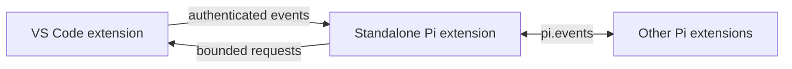

# Pi Agent for VS Code

Bring your existing [Pi](https://pi.dev) setup into VS Code. Work in a persistent Pi conversation, use the native `@pi` chat participant, attach editor context, and review proposed changes before applying them.

## Highlights

- **Persistent Pi Chat** — Stream responses; keep submitted context and image thumbnails on the user turn that used them; rename, resume, compact, export, or delete sessions; and hand a session off to the terminal.
- **Editor-aware context** — Attach selections, files, diagnostics, terminal text, and images. Inspect, redact, refresh, or pin attachment snapshots before sending them. Open submitted images in a keyboard-accessible preview.
- **Reviewable edits** — Preview full proposals or select individual hunks, then apply the reviewed result with one workspace edit.
- **Focused workflows** — Review staged changes, import results from isolated worktree agents, repair failed tests, inspect request checkpoints, and ask read-only questions about paused Node.js debug values.
- **Coding assistance** — Fix diagnostics, edit selections, generate tests, request inline completions, and predict the next edit.
- **Pi ecosystem support** — Use Pi providers, models, thinking levels, prompt templates, skills, extensions, and contributed tools.
- **VS Code bridge** — Let authenticated Pi extensions read bounded editor context, open files, and show notifications.

See the [feature matrix](https://github.com/narumiruna/pi-vscode/blob/main/docs/FEATURE_MATRIX.md) for the complete capability map.

## Requirements

- VS Code 1.106 or newer
- [Pi](https://pi.dev), installed and authenticated

Confirm that Pi is available in the same environment where VS Code runs the extension:

```bash
pi --version
```

Building from this repository also requires Node.js, npm, [`just`](https://just.systems), and the VS Code `code` command.

## Install from source

Remove either legacy extension, `narumitw.pi-coding-agent` or `narumi.pi-coding-agent`, if installed. They contribute the same views and commands as the current extension, but VS Code treats each ID as a separate extension.

```bash
code --uninstall-extension narumitw.pi-coding-agent
code --uninstall-extension narumi.pi-coding-agent
npm install
just install
```

The current extension ID is `narumi.pi-agent`. In WSL, SSH, or a dev container, remove installed legacy extensions from the connected remote environment as well. VS Code does not automatically migrate extension-scoped state to the new ID; command IDs and `piCodingAgent.*` settings remain unchanged.

`just install` installs the VS Code extension and copies the standalone Pi extension to `${PI_CODING_AGENT_DIR:-~/.pi/agent}/extensions/pi-vscode.ts`.

After installation or an update:

1. Run **Developer: Reload Window**.
2. Open a new integrated terminal so Pi inherits the authenticated bridge environment.

To install only the standalone Pi extension, run:

```bash
just install-pi-extension
```

## Get started

1. Run **Pi: Open Chat** from the Command Palette, or open **Pi** in the Secondary Sidebar.
2. Add context from the composer, or paste a supported image with Ctrl/Cmd+V.
3. Enter a request. The active model and thinking level appear beside **Send**.
4. Review generated edits with **Preview**, optionally choose hunks, and explicitly **Apply** the result.
5. Open **More…** for session management, commands, export, terminal handoff, staged review, repair tools, checkpoints, and background or worktree agents.

Editor shortcuts and actions:

- **Ctrl/Cmd+I** fixes an error or warning at the cursor. Without a diagnostic, it opens the focused inline-edit prompt.
- **Alt+]** manually requests an inline completion.
- **Ctrl+Alt+N** (**Cmd+Alt+N** on macOS) suggests the next edit.
- The editor lightbulb's **Rewrite** section offers **Ask Pi** and **Modify with Pi** for a selection.
- The editor's **Pi** context menu provides the same selection workflows plus focused presets.

Use `@pi` in VS Code's native Chat view when you prefer the native participant workflow. Native Chat history is separate from the Pi Sidebar session.

Automatic inline completions are disabled by default. Enable `piCodingAgent.inlineCompletions.enabled` to request them after a typing pause.

## Workflows

| Workflow | How to use it |
| --- | --- |
| **Staged review** | Choose **More… → Review Staged Changes** or run **Pi: Review Staged Changes**. Confirm the bounded snapshot, then use **Pi: Show Staged Findings** to navigate immutable before/after content. Findings become stale when HEAD or the index changes. |
| **Selected edits** | On a proposal card, choose **Choose Hunks → Preview → Apply**. Changing the hunk selection invalidates the preview. Unselected hunks remain unapplied; use normal editor Undo after application. |
| **Worktree result import** | Start an isolated agent from **More…**. When it is inactive, select **Review Results → Apply Selected** to import reviewed text files into the originating worktree. Remove the task worktree only when recovery is no longer needed. |
| **Context inspector** | Select **Inspect Context** beside an attachment or under **Add context**. Inspect the exact snapshot, edit or redact it, refresh it explicitly, or pin it for later requests. After sending, context chips and image thumbnails remain with that user turn; unavailable historical image bytes remain as labeled placeholders. |
| **Failed-test repair** | Run **Pi: Repair Failed Test (Preview)**. Provide an executable and argument array, select one saved source file, approve a run or select an existing UTF-8 log, inspect the evidence, then preview and apply the repair. |
| **Request checkpoints** | Choose **More… → Request Checkpoints**. Inspect coverage, select files, preview the restore, then choose **Revert Covered Changes**. This is memory-only file recovery, not a Git or conversation rewind. |
| **In-flight instructions** | While a normal request is running, Enter sends **Steer** after current tool calls. Alt+Enter sends **Follow Up** on macOS and Linux; Windows uses Ctrl+Q, including remote WSL sessions. The composer shows pending counts, and **Recovered Drafts** preserves cleared or uncertain text. |
| **Debug question** | Pause a Node.js debugger, then run **Pi: Ask Debug Context**. Approve capture, choose local variables, inspect or redact the snapshot, and ask a read-only question. Resuming or changing frames invalidates it. |

New process and mutation workflows require a trusted, file-backed workspace. Pi sessions and foreground targets must match the active working directory. Open an isolated worktree in its own VS Code window before resuming that worktree's session.

### Important limits

- Staged review supports up to 100 text files, 100 KB per blob, 400 KB of total blob content, and a 200 KB diff. Binary files, symlinks, submodules, and unsafe or oversized inputs are skipped.
- Task import supports additions, modifications, and deletions for regular UTF-8 text files. It does not import symlinks, binary files, unsupported paths, or executable-bit changes. Dirty, overlapping, stale, or unverifiable destinations are rejected.
- Attachments allow 8 items and 400,000 total text characters, including up to 5 images of 5 MiB each. Pins are memory-only, never refresh silently, and expire when the session changes or VS Code reloads.
- Transcript metadata is persisted, but image Base64 is not. Valid image payloads use a one-shot Webview channel and bounded 100-asset / 25 MiB caches in the Extension Host and Webview. Each image is limited to 5 MiB and 16,777,216 decoded pixels. Pi history conversion selects only the retained 100-message suffix and caps each synchronization at 25 MiB of image processing, newest turns first. Evicted, malformed, unsupported, browser-rejected, or unrecoverable images remain visible as unavailable placeholders; browser-rejected content remains blocked from re-delivery during the Extension Host lifecycle.
- Test repair accepts an executable plus arguments, not a shell expression. Runs require approval, stop after 60 seconds, cap output at 256 KiB, and allow at most two repair attempts.
- Checkpoints retain up to 20 requests in memory. Only deterministically observed edits to captured regular text files are restorable; shell effects, file creation/deletion, dirty buffers, and ambiguous changes are excluded.
- The in-flight queue is limited to 10 plain-text messages and 50,000 characters. Attachments and slash commands cannot be queued, and uncertain delivery is never replayed automatically.
- Debug capture supports paused `node` and `pwa-node` js-debug sessions only. It does not evaluate expressions, recurse through values, read memory, or mutate debugger state.

For threat boundaries and exact safeguards, read [Security and Privacy](https://github.com/narumiruna/pi-vscode/blob/main/docs/SECURITY.md). For tested and deferred behavior, read [Workflow Validation](https://github.com/narumiruna/pi-vscode/blob/main/docs/WORKFLOW_VALIDATION.md).

## Settings

| Setting | Default | Purpose |
| --- | --- | --- |
| `piCodingAgent.executablePath` | `pi` | Pi executable name or absolute path. |
| `piCodingAgent.provider` | Empty | Optional provider override; empty uses Pi settings. |
| `piCodingAgent.model` | Empty | Optional model override; empty uses Pi settings. |
| `piCodingAgent.thinkingLevel` | `default` | Optional thinking-level override. |
| `piCodingAgent.agent.confirmToolCalls` | `dangerous` | Approval policy for Pi's built-in `bash`, `edit`, and `write` tools. |
| `piCodingAgent.approveProjectResources` | `false` | Allows trusted project-local Pi settings, extensions, skills, and prompts. |
| `piCodingAgent.sensitiveContextNames` | Sensitive filename fragments | Adds best-effort warnings to matching attachment labels. |
| `piCodingAgent.inlineCompletions.enabled` | `false` | Enables automatic inline completions. |

Additional settings control inline-completion delay, minimum prefix length, and excluded languages.

## Security model

Pi Sidebar sessions expose Pi's default coding tools and tools contributed by installed Pi extensions. The packaged confirmation policy applies only to the built-in `bash`, `edit`, and `write` tools; contributed tools define their own permission behavior.

Focused edit workflows use a packaged read-only policy while generating proposals. Applying a proposal, importing worktree results, rerunning tests, and restoring checkpoints remain explicit user actions. Project-local Pi resources stay disabled until the workspace is trusted and `piCodingAgent.approveProjectResources` is enabled.

Prompts and context are sent to Pi through standard input, not command-line arguments. The selected Pi provider receives approved prompts and context under that provider's own data policy. Routine Sidebar state and workspace storage contain transcript image metadata only, not Base64 payloads.

Request tool activity follows the active response in the conversation scroller. Edit proposals, changed files, and background agents remain in the workflow area. Busy, cancellation, reconnect, and failure states share the runtime status surface; short operational errors expose full details only through **Details**.

Conversation deletion first requests Trash. If a remote file provider specifically reports Trash as unavailable, the conversation is kept and permanent deletion is offered in a second modal confirmation. Other deletion failures never fall through to permanent deletion. If recovery starts a replacement Pi session, the old transcript is cleared before that replacement can accept requests.

## Extension bridge

The standalone Pi extension and VS Code extension communicate over an authenticated local bridge:



Other Pi extensions can send an allowlisted request and receive the correlated response:

```typescript
pi.events.emit("vscode:request", {
  id: "current-editor",
  method: "context",
  params: {},
});

pi.events.on("vscode:response", response => {
  // { id, ok, result } or { id, ok, error }
});

pi.events.on("vscode:event", message => {
  // { event, data }
});
```

The standalone extension provides `vscode_context`, `vscode_open_file`, and `vscode_notify` when Pi starts from a new integrated terminal or from Pi Chat. VS Code extensions in the same Extension Host can activate `narumi.pi-agent` and call its exported `broadcast(event, data)` API. Event names and payloads are validated and bounded.

## Development

```bash
npm install
npm test
npm run package
```

`npm test` compiles the extension and runs the Node test suite. `npm run package` repeats those checks and creates `pi-agent.vsix`.

Use `just dev` to compile the extension, open an Extension Development Host, and run Pi with `resources/pi-vscode-bridge.ts` in the invoking terminal. The recipe and the **Run Extension** debug configuration disable both `narumitw.pi-coding-agent` and `narumi.pi-coding-agent` only in the development window to prevent duplicate registrations.

## Troubleshooting

### `View provider for piCodingAgent.chatView already registered`

A legacy extension is enabled alongside `narumi.pi-agent`.

1. Search Extensions for `@id:narumitw.pi-coding-agent` and `@id:narumi.pi-coding-agent`.
2. Disable or uninstall either legacy extension in the local or connected remote environment.
3. Run **Developer: Reload Window**.

When developing, close the existing Extension Development Host and relaunch it with `just dev` or **Run Extension**. Reloading an already-running development window does not add updated launch arguments.

## License

[MIT](LICENSE)
