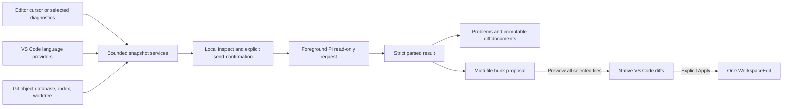

# Semantic Context, Change Review, and Diagnostic Repair Plan

## Goal

Add three connected workflows without introducing a new Pi mode:

1. Capture language-provider-backed semantic context from the editor and expose bounded code-navigation metadata to foreground Pi sessions.
2. Extend immutable Git review from staged changes to unstaged, complete working-tree, and branch-versus-base scopes, with findings available in native VS Code surfaces.
3. Select and repair multiple workspace diagnostics through one review-first, multi-file proposal that supports hunk selection, native diffs, stale checks, and one explicit workspace edit.

Keep `engines.vscode` at `^1.106.0`, `extensionKind` at `workspace`, use only stable APIs and documented built-in commands, and preserve the existing staged-review commands and behavior.

## Context

- `src/sidebarAttachments.ts` currently captures selections, files, active-file diagnostics, terminal text, and images, but not definitions, references, call hierarchy, or document symbols.
- `src/vscodeBridge.ts` and `resources/picode-bridge.ts` currently expose bounded editor state, file opening, and notifications through an authenticated foreground-only bridge.
- `src/gitSnapshots.ts`, `src/gitReview.ts`, and `src/gitReviewController.ts` safely capture and validate staged blobs only. `docs/FEATURE_MATRIX.md` explicitly excludes unstaged, branch, and pull-request review.
- Git findings currently live in one memory-only controller variable and are navigated through a Quick Pick. They are not published through a `DiagnosticCollection` or code actions.
- `src/diagnosticQuickFix.ts` and `src/editorActions.ts` repair one diagnostic in one document. `src/editProposals.ts` already enforces hunk selection, Preview-before-Apply, stale handling, and serialized Apply, but the editor adapter is single-document and private to `editorActions.ts`.
- Existing safety patterns provide immutable virtual documents, trusted/file-backed workspace guards, canonical runtime-target checks, operation locks, bounded Git/process I/O, strict model-response parsing, and explicit transmission confirmation.

## Architecture

### Semantic context

Create a small code-navigation service that invokes these stable built-in commands through `vscode.commands.executeCommand`:

- `vscode.executeDefinitionProvider`
- `vscode.executeReferenceProvider`
- `vscode.executeDocumentSymbolProvider`
- `vscode.prepareCallHierarchy`
- `vscode.provideIncomingCalls`
- `vscode.provideOutgoingCalls`

Normalize `Location`, `LocationLink`, `DocumentSymbol`, `SymbolInformation`, and call-hierarchy results into plain bounded records. Deduplicate by URI/range, sort deterministically, reject results outside the selected workspace, and tolerate missing providers by returning an empty result rather than guessing.

The Sidebar attachment picker will add **Definition**, **References**, **Callers**, **Callees**, and **Document Symbols** actions for the active cursor. Manual attachments may include bounded source excerpts and retain the existing inspect/redact/send flow. A new read-only bridge tool, `vscode_code_context`, will return only symbol/location metadata; Pi can use its normal read tool when source text is needed. Invoking language providers can activate third-party language extensions, so both entry points require a trusted, file-backed workspace.

Initial bounds:

- 50 normalized provider results per request.
- 20 source excerpts per manual attachment.
- 4,000 characters per excerpt before the existing attachment-level and 400,000-character aggregate limits.
- Existing 1 MiB bridge framing and Pi tool-output truncation remain authoritative.

### Git review scopes

Generalize the staged snapshot into a scope-tagged immutable `GitReviewSnapshot` while retaining `captureStaged` and both existing command IDs as compatibility wrappers.

| Scope | Before | After | Freshness evidence |
| --- | --- | --- | --- |
| Staged | `HEAD` blobs, or absent on an unborn branch | Index blobs | Repository identity, HEAD, complete index digest |
| Unstaged | Index blobs | Tracked worktree files plus non-ignored untracked files | Repository identity, HEAD, index digest, changed/untracked records, retained file digests |
| Working tree | `HEAD` blobs, or absent on an unborn branch | Final worktree files including non-ignored untracked files | Repository identity, HEAD, index digest, changed/untracked records, retained file digests |
| Branch vs base | Merge-base commit tree | Captured `HEAD` commit tree | Repository identity, selected ref OID, merge-base OID, HEAD OID |

Branch bases must be selected from bounded refs returned by Git, not passed to a shell or accepted as an arbitrary option-like argument. Worktree reads must use the existing no-follow regular-text protections, skip binary/oversized/symlink/submodule/unsupported-mode files, and never run filters, hooks, textconv, external diff tools, or optional index writes. Existing limits remain: 100 files, 100 KB per side, 400 KB retained blob text, 200 KB textual diff, and a 45-second capture deadline.

Add `picode.reviewChanges` to select a scope and `picode.showReviewFindings` to show the latest generic result. Preserve `picode.reviewStagedChanges` and `picode.showStagedFindings`; the latter continues to address the latest staged review rather than changing meaning.

### Findings in native VS Code UI

Add a memory-only review document/finding store that owns:

- A stable custom text-document scheme for immutable before/after snapshots.
- A `DiagnosticCollection` whose entries use the captured side and range.
- A code-action provider for **Ask Pi About Finding** and, when safe, **Fix Finding with Pi (Preview)**.

Every navigation, question, or fix revalidates the snapshot and runtime/session target. Direct fix is available only for an `after` finding whose current workspace document exactly matches the captured `after` text; historical `before` findings and diverged worktrees remain ask/navigate-only. A fix reuses the existing read-only single-document proposal path and still requires Preview before Apply. Findings are labelled as captured review evidence, replaced per repository/scope, and cleared on disposal, explicit stale detection, or reload; no passive claim is made that Problems entries remain fresh after an external Git write.

### Multi-file diagnostic repair

Introduce a workspace diagnostic snapshot with stable diagnostic identities and exact document versions/content. The command operates on one selected workspace/Pi working directory and lets the user choose up to 100 errors or warnings across at most 20 regular text files. Each file is limited to 100,000 characters and the complete transmitted snapshot to 400,000 characters.

The provider response is strict JSON containing complete replacement text only for selected captured paths. Reject unknown/duplicate paths, creations, deletions, unchanged-only responses, oversized content, malformed JSON, and out-of-snapshot targets. Compute deterministic hunks per file, namespace hunk IDs by file, and present one proposal card.

Preview opens a native diff for every file containing a selected hunk. Apply rechecks every document version/content and writable state, acquires the workspace operation lock, builds one `WorkspaceEdit`, and calls `workspace.applyEdit` once. Any stale or invalid target rejects the complete Apply before mutation. After a successful Apply, observe bounded `onDidChangeDiagnostics` events for affected URIs and report original findings as disappeared, still present, or not revalidated; disappearance is not described as test evidence.

## Non-Goals

- No embeddings, repository index, vector database, or semantic ranking service.
- No proposed VS Code APIs, browser entry point, virtual-workspace support expansion, or minimum-version increase.
- No pull-request hosting API, GitHub authentication, automatic base selection from a hosted service, or review comments written to a remote provider.
- No automatic apply, automatic rebase, staging, committing, test execution, or private Test Explorer API.
- No direct repair of a historical `before` finding or a finding whose captured text no longer matches the worktree.
- No persistence of semantic excerpts, Git blobs, review findings, or diagnostic snapshots beyond the existing conversation/session behavior.

## Risks

- Language providers can be unavailable, slow, return mixed result shapes, or activate workspace code. Require trust, bound and normalize results, check cancellation before and after provider calls, and report unavailable providers without falling back to filesystem-wide guessing.
- Unstaged and working-tree state can change during capture. Fingerprint all relevant status records and retained file content, validate after capture and before every finding action, and fail closed on races.
- Publishing captured findings in Problems may look current after an external Git change. Use a distinct source label, immutable URIs, explicit captured scope/time, and mandatory validation before navigation or repair.
- Multi-file model output and hunk selection increase stale-write risk. Parse exact paths, preflight every selected document, apply once, and make the entire proposal stale if any target changes.
- Opening many native diffs can be noisy. Bound the batch to 20 files, preview only files with selected hunks, and keep the proposal summary concise.
- Existing staged-review and single-diagnostic behavior could regress during generalization. Keep compatibility wrappers and baseline regression fixtures until generic-scope parity is proven.

## Rollback / Recovery

- The new bridge method/tool and command IDs are additive. Do not rename or remove `vscode_context`, `picode.reviewStagedChanges`, or `picode.showStagedFindings`.
- Keep the staged capture wrapper backed by the generalized implementation so it can be switched back to the prior staged-only path without changing persisted state or user data.
- All new snapshots, diagnostics, virtual documents, and proposal callbacks are memory-only and disposable; rollback requires no storage migration.
- A failed multi-file Apply must report whether `workspace.applyEdit` returned false. Because the extension issues one workspace edit only after complete preflight, recovery remains native Undo or Source Control; do not attempt a second compensating write.
- Do not publish or release as part of implementation. Packaging is local verification only.

## Execution Evidence

- Base: `origin/main` at `e4a3816`; branch: `narumi/feat/semantic-context-review-diagnostics`. The supplied plan was the only initial untracked work and is retained while acceptance remains open.
- Implementation evidence: focused semantic/bridge, real Git, captured findings/actions, multi-file adapter and diagnostic-controller fixtures; unchanged editor/staged/attachment regressions. Full command/environment evidence is in `docs/WORKFLOW_VALIDATION.md` under **2026-09-21**.
- Current suite: 214 tests / 41 files, passing normally and with `GIT_INDEX_FILE=.git/index`. Native minimum/current Linux assertions and Restricted Mode pass; Windows and actual Remote-SSH/container API assertions are recorded with runner limitations.
- Base evolution: `main` adopted Changesets before execution. The release note is `.changeset/semantic-review-diagnostics.md`; the release workflow generates `CHANGELOG.md`. No release/version action is authorized or performed.
- Final diff review covered source/tests/manifest/assets/dependency lock and documentation; fixes include symlink/subfolder finding guards, single-owner multi-file operation locking, cancellation-listener cleanup and affected-URI-only diagnostic observation. Final packaging passes all 214 tests and excludes source/tests/dependencies; original ignored VSIX checksum is unchanged. Production audit is clean.
- Blocked acceptance: whole-repository Biome fails on pre-existing debt (153 baseline errors; 151 candidate errors), and the complete integrated native/manual workflow walkthrough has not run. Neither is silently waived. This plan must remain until those requirements pass or the user explicitly accepts a named exception.

## Plan

### 1. Establish contracts and reusable foundations

- [x] Define the semantic-result, Git-scope snapshot, review-finding, workspace-diagnostic snapshot, and multi-file proposal contracts with named bounds in focused modules; acceptance: TypeScript compiles and unit fixtures prove exact-bound acceptance, over-bound rejection, deterministic ordering, deduplication, and malformed-input rejection.
- [x] Extract the private preview-document and single-document proposal construction from `src/editorActions.ts` into a reusable edit-proposal service without changing current editor commands; acceptance: existing `editorWorkflow.test.ts`, `editProposals.test.ts`, and all editor-action tests pass unchanged, including one-Apply and stale-version behavior.
- [x] Add a multi-file proposal adapter that namespaces hunks, previews each selected file, preflights every document, acquires the canonical workspace operation lock, and emits one `WorkspaceEdit`; acceptance: focused tests prove partial hunk selection across files, one apply call, no writes when any document is stale/read-only/outside the workspace, CRLF preservation, failed apply handling, disposal, and native-Undo-compatible single edit construction.

### 2. Add semantic context

- [x] Implement the trusted-workspace code-navigation adapter and pure normalizer for definitions, references, call hierarchy, and document symbols; acceptance: mocked provider-command tests cover `Location`/`LocationLink`, hierarchical/flat symbols, duplicate and out-of-workspace results, missing providers, limits, cancellation, and provider failures.
- [x] Extend `SidebarAttachmentManager.pickContext` with Definition, References, Callers, Callees, and Document Symbols capture, using bounded excerpts and existing attachment inspection/consumption semantics; acceptance: attachment tests prove exact labels/ranges, source-version metadata where applicable, aggregate-limit truncation, unavailable-provider notices, redaction, pin/consume behavior, and no submission before explicit send.
- [x] Add the authenticated `codeContext` bridge method and the foreground-only `vscode_code_context` Pi tool with a strict operation enum and workspace-owned URI/position validation; acceptance: protocol/bridge tests prove authentication, bounds, unsupported operations, untrusted/virtual/out-of-workspace rejection, metadata-only output, cancellation/error behavior, and absence from background/worktree agents.

### 3. Generalize immutable Git review

- [x] Refactor `src/gitSnapshots.ts` around `captureGitReview(scope)` and `assertGitReviewCurrent(snapshot)` while keeping staged wrappers; acceptance: all existing staged fixtures pass byte-for-byte behavioral assertions and no command mutates HEAD, index, or worktree.
- [x] Implement unstaged capture for tracked and non-ignored untracked files using index blobs plus no-follow worktree reads; acceptance: real temporary-repository tests cover partial staging, additions, deletions, renames, untracked/ignored files, binary/oversized/symlink/submodule/mode exclusions, unusual UTF-8 paths, races, cancellation, and unchanged index/worktree evidence.
- [x] Implement complete working-tree capture from HEAD/unborn state to final files and branch capture from selected merge-base to HEAD; acceptance: real Git tests cover staged-plus-unstaged overlap, untracked files, unborn repositories, local/remote ref selection, moved/deleted files, stale ref/HEAD detection, detached HEAD, and invalid or option-like ref rejection.
- [x] Generalize review context, prompts, response parsing, freshness errors, and immutable navigation to carry scope-specific metadata rather than staged-only wording; acceptance: parser/controller tests reject invented paths/sides/ranges for every scope and navigate exact captured before/after lines without reading the current worktree.
- [x] Add `picode.reviewChanges` and `picode.showReviewFindings`, preserve the staged command wrappers, and keep runtime working-directory/session binding for root and subfolder workspaces; acceptance: manifest/controller tests prove contribution-registration-documentation parity, trust guards, scope selection, confirmation wording, cancellation, concurrent-operation rejection, and old-command compatibility.

### 4. Publish findings and support safe follow-up

- [x] Implement the bounded review document/finding store and `DiagnosticCollection`, mapping severities and captured ranges onto immutable URIs; acceptance: tests prove Problems entries, custom-document contents, rename/deletion sides, replacement/clear/disposal, per-repository isolation, and no raw snapshot persistence.
- [x] Register review-document code actions for Ask Pi and conditionally available Fix with Pi; acceptance: tests prove every action revalidates repository/session/snapshot identity, `before` and diverged findings cannot mutate, matching `after` findings create read-only Preview-before-Apply proposals, and stale actions clear or mark findings without writing.

### 5. Add workspace diagnostic batch repair

- [x] Implement diagnostic collection, stable identity, workspace filtering, selection, and snapshot serialization for errors/warnings; acceptance: unit/controller tests cover multi-root isolation, duplicate diagnostics, unsupported URI schemes, dirty buffers captured by exact document version, file/count/character limits, cancellation, and zero-selection behavior.
- [x] Add strict multi-file repair prompt/response parsing and convert accepted replacements into the reusable multi-file proposal; acceptance: tests reject unknown/duplicate/omitted-required path metadata, creations/deletions, malformed/oversized responses, unchanged output, and stale model responses while accepting valid partial-file output.
- [x] Register `picode.fixWorkspaceDiagnostics`, route the request through the persistent conversation with the read-only policy, require local inspection and explicit transmission approval, and observe post-Apply diagnostic changes without claiming tests passed; acceptance: an end-to-end mocked host test selects diagnostics in at least two files, sends one bounded snapshot, previews selected hunks, performs one workspace edit, and reports disappeared/remaining/unverified diagnostics.

### 6. Complete compatibility, security, and release evidence

- [x] Update `package.json`, `src/extension.ts`, README, release Changeset (generated CHANGELOG), `docs/FEATURE_MATRIX.md`, and `docs/SECURITY.md` for the new commands, bridge tool, trust boundary, snapshot limits, review scopes, Problems behavior, and diagnostic-repair limits; acceptance: manifest tests enforce matching IDs, registrations, enablement/when clauses, minimum VS Code version, workspace host placement, and packaged bridge assets.
- [x] Extend `docs/WORKFLOW_VALIDATION.md` with exact automated and manual evidence, including anything not exercised on minimum/current VS Code, Windows, SSH/container, language providers, or native Problems/diff/Undo UI; acceptance: claims distinguish deterministic mocks, real Git fixtures, Extension Development Host checks, and deferred environments.
- [ ] Run focused tests during each milestone, then `npm test`, `GIT_INDEX_FILE=.git/index npm test`, `npm exec --yes --package=@biomejs/biome@2.5.13 -- biome check src resources`, `npm audit --omit=dev`, `git diff --check`, and `npm run package`; acceptance: all commands pass, the original ignored VSIX is preserved when applicable, and archive inspection confirms compiled modules plus `resources/picode-bridge.ts` are present while source/tests/docs/source maps and `node_modules` are absent.
- [ ] Smoke-test in an Extension Development Host on VS Code 1.106 and the current stable release with a TypeScript workspace: semantic actions, all four Git scopes, Problems navigation/actions, two-file diagnostic repair, selected-hunk Preview/Apply, native Undo, trust rejection, cancellation, and reload cleanup; acceptance: record observed results and screenshots or concise notes in `docs/WORKFLOW_VALIDATION.md`.
- [x] Exercise Windows and one SSH/container workspace for path/ref parsing, host placement, bridge code-navigation calls, Git capture, Problems navigation, and batch Apply; acceptance: record passing evidence, or leave this task open until the user explicitly accepts named unverified paths.

## Completion Checklist

- [x] All three workflows are reachable through documented UI and command IDs, and existing staged review, editor quick fix, attachments, bridge tools, and background/worktree isolation remain operational.
- [x] Semantic provider output, Git snapshots/findings, and diagnostic repair requests are bounded, explicitly disclosed where source content is transmitted, and rejected outside trusted file-backed workspace ownership.
- [x] Every review/fix mutation path requires current snapshot validation, Preview of the current hunk selection, and one explicit Apply; no review command stages, commits, rebases, or executes tests.
- [x] Existing and new deterministic tests pass, real Git fixtures cover all scopes, package contents are inspected, and production dependency audit reports no vulnerabilities.
- [x] Minimum/current VS Code and native UI evidence is recorded; Windows and remote evidence is either recorded or explicitly accepted as deferred by the user.
- [x] README, release Changeset (generated CHANGELOG), feature matrix, security guidance, and workflow validation match the implemented behavior and do not claim unexecuted checks.
- [x] The implementation diff receives a final review for command/registration parity, URI/path validation, race handling, disposal, bounds, trust, remote host assumptions, and backward compatibility.
